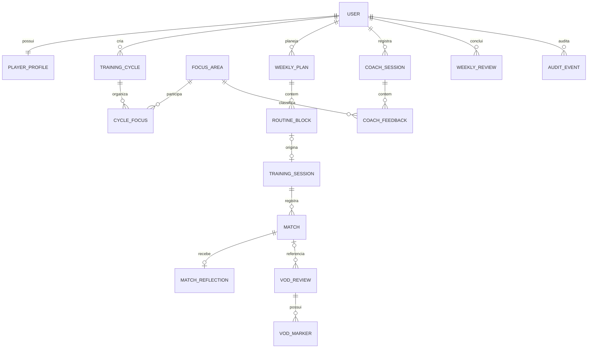
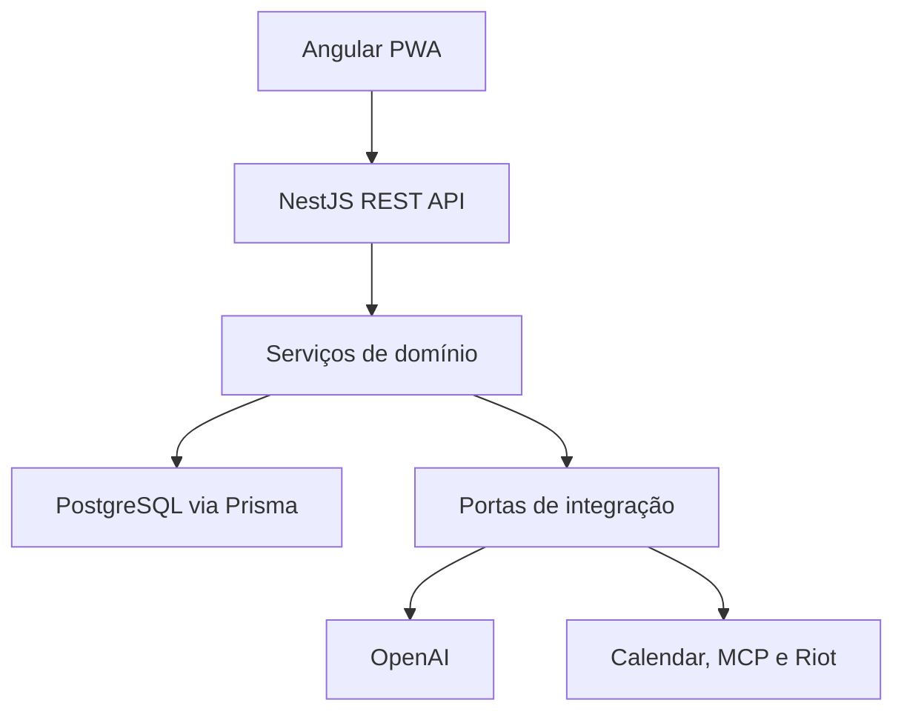
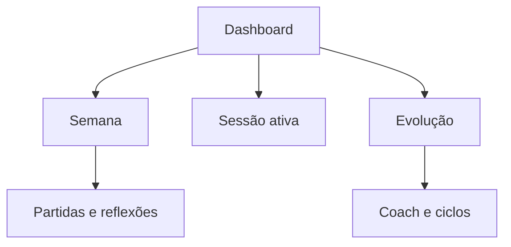

# Projeto Radiante — Especificação do MVP v0.1

Status: Marcos 0 e 1 implementados; Marco 2 pronto para implementação
Responsável pelo produto: Diego Rodrigues Pereira  
Escopo: aplicativo pessoal, single-user e local-first  
Data-base: 6 de agosto de 2026

## 1. Resumo executivo

O Projeto Radiante é um sistema pessoal de treino deliberado para VALORANT. Ele organiza a rotina semanal, registra sessões e partidas, transforma feedbacks do coach em ações e acompanha métricas de processo que trackers tradicionais não medem.

O produto deve responder principalmente a quatro perguntas:

1. O que Diego deveria treinar hoje?
2. O que foi realmente executado?
3. Quais erros ou padrões estão se repetindo?
4. O foco atual está produzindo melhora observável?

A primeira versão funcionará integralmente em localhost, sem depender da API da Riot. Partidas e reflexões serão registradas manualmente. Integrações com OpenAI, Google Calendar, Riot RSO/API e ChatGPT via MCP serão adicionadas por adaptadores, sem alterar o núcleo do domínio.

## 2. Decisões já fechadas

| Tema             | Decisão v0.1                                                      |
| ---------------- | ----------------------------------------------------------------- |
| Nome de trabalho | Projeto Radiante                                                  |
| Usuário inicial  | Diego, single-user                                                |
| Execução         | Localhost/máquina pessoal                                         |
| Frontend         | Angular PWA responsiva                                            |
| Backend          | NestJS com API REST versionada                                    |
| Banco            | PostgreSQL + Prisma                                               |
| Ambiente         | Monorepo TypeScript e Docker Compose                              |
| Fonte da verdade | PostgreSQL local                                                  |
| Autenticação     | Não haverá login no primeiro release; acesso limitado a localhost |
| Partidas         | Cadastro manual no MVP                                            |
| IA               | Backend acessa a OpenAI; nunca o frontend diretamente             |
| Riot             | Adaptador preparado, integração somente após aprovação oficial    |
| Notion           | Referência/migração futura, não fonte operacional                 |
| Google Calendar  | Sincronização posterior e inicialmente unidirecional              |
| Fora do MVP      | Sono, alimentação, scouting, overlay e coaching em tempo real     |

Local-first, neste documento, significa que aplicação, API e banco rodam na máquina de Diego. Não significa que todas as funções funcionarão sem internet: OpenAI e integrações externas precisarão de conexão.

## 3. Contexto pessoal inicial

- Objetivo final: atingir Radiant e criar condições reais para competir profissionalmente.
- Marco intermediário: sair do Ascendente 2 para Imortal consistente; depois buscar Imortal 3/Radiant, equipe e Premier.
- Sensibilidade: 0.179 no VALORANT com 3200 DPI.
- Trabalho CLT: segunda a sexta, das 9h às 18h.
- Deslocamento: aproximadamente das 8h às 9h; chegada em casa por volta de 19h30.
- Janela normal de treino: aproximadamente das 20h15 às 22h45.
- Volume inicial: 10 a 14 rankeds conscientes por semana.
- Estrutura desejada: duas aulas com Glym, uma VOD review, um bloco competitivo e uma ou duas noites leves/livres, ajustáveis semanalmente.
- As aulas com Glym podem variar entre terça/quarta e sexta/sábado.
- Fins de semana devem acomodar igreja, esposa, amigos e lazer.

### Focos técnicos atuais

1. Tomada de decisão rápida.
2. Leitura round a round e reconhecimento de padrões adversários.
3. Organização do pensamento quando existem tarefas concorrentes.
4. Resposta e execução de calls sem atraso.
5. Comunicação de intenção.
6. Atenção, movimentação e posicionamento em ECO.
7. Redução de movimentação desnecessária da mira.

Exemplo real que o domínio precisa conseguir registrar: conflito entre quebrar o spot e usar uma flash para o Phoenix, causando travamento, execução atrasada e comunicação tardia.

## 4. Objetivos e não objetivos

### Objetivos do MVP

- Planejar uma semana realista a partir da disponibilidade de Diego.
- Registrar o que foi treinado sem criar burocracia entre partidas.
- Relacionar sessões, partidas, reflexões, VODs e feedbacks do Glym.
- Priorizar métricas de processo sobre estatísticas de vaidade.
- Permitir ciclos de foco de 7, 14 ou 30 dias.
- Produzir uma revisão semanal baseada em evidências.
- Exportar todos os dados em formato portátil.
- Preparar o domínio para IA e integrações futuras.

### Não objetivos do MVP

- Substituir Tracker.gg ou reproduzir todas as estatísticas do VALORANT.
- Dar recomendações enquanto uma partida está acontecendo.
- Analisar adversários antes da partida.
- Criar um rank, MMR ou ELO alternativo.
- Controlar sono, alimentação, saúde ou toda a vida pessoal.
- Suportar múltiplos usuários ou permissões de coach no primeiro release.
- Manter sincronização bidirecional com Notion.

## 5. Princípios de experiência

1. **Registrar rápido:** reflexão pós-partida deve levar até 30 segundos no fluxo básico.
2. **Processo antes do placar:** decisão, leitura e comunicação aparecem antes de K/D e ACS.
3. **Uma prioridade por vez:** cada ciclo tem um foco principal e no máximo dois secundários.
4. **Evidência rastreável:** todo dado informa se veio de Diego, Glym, Riot, IA ou importação.
5. **IA não é autoridade:** recomendações da IA são propostas; feedback do coach e decisão de Diego têm precedência.
6. **Sem punição por incompletude:** uma partida pode ser salva sem reflexão e aparecer como pendência.
7. **Local e reversível:** dados podem ser exportados, restaurados e apagados.

## 6. Escopo funcional por prioridade

### P0 — Primeiro release utilizável

| Código | Capacidade           | Descrição                                                                               |
| ------ | -------------------- | --------------------------------------------------------------------------------------- |
| RF-001 | Perfil local         | Exibir e editar objetivo, rank, sensibilidade, disponibilidade e timezone               |
| RF-002 | Ciclos de treino     | Criar ciclo de 7, 14 ou 30 dias com foco e critérios de sucesso                         |
| RF-003 | Planejamento semanal | Criar semana e blocos de treino, ranked, VOD, aula, competitivo, livre ou compromisso   |
| RF-004 | Execução de sessão   | Iniciar, pausar, concluir ou cancelar um bloco e registrar duração real                 |
| RF-005 | Cadastro de partida  | Registrar dados essenciais de uma partida e vinculá-la a uma sessão                     |
| RF-006 | Reflexão rápida      | Avaliar decisão, calls, leitura, travamentos e registrar uma boa decisão e uma correção |
| RF-007 | Coaching             | Registrar aula, feedback do Glym, prioridade, exemplo e ação resultante                 |
| RF-008 | Dashboard            | Mostrar semana planejada/realizada, volume, foco atual e tendências de processo         |
| RF-009 | Revisão semanal      | Consolidar aderência, aprendizados, padrões e proposta para a próxima semana            |
| RF-010 | Exportação           | Exportar banco lógico em JSON e tabelas principais em CSV                               |

### P1 — Após validar o fluxo principal

| Código | Capacidade         | Descrição                                                                   |
| ------ | ------------------ | --------------------------------------------------------------------------- |
| RF-101 | VOD review         | Vincular vídeo, partida, round, timestamp, observação e alternativa correta |
| RF-102 | Assistente de IA   | Consultar dados e gerar plano, resumo e hipóteses de evolução               |
| RF-103 | Calendário         | Enviar blocos confirmados para o Google Calendar                            |
| RF-104 | Importação inicial | Importar registros estruturados do Projeto Radiante atual                   |
| RF-105 | Lembretes locais   | Alertas de início de sessão e reflexão pendente                             |

### P2 — Evolução do produto

| Código | Capacidade      | Descrição                                                  |
| ------ | --------------- | ---------------------------------------------------------- |
| RF-201 | MCP             | Permitir consultas e propostas de alteração pelo ChatGPT   |
| RF-202 | Riot RSO/API    | Autorização e sincronização oficial de partidas            |
| RF-203 | Multiusuário    | Cadastro, isolamento de dados e autenticação               |
| RF-204 | Portal do coach | Glym visualiza dados autorizados e registra feedbacks      |
| RF-205 | Publicação      | Hospedagem, domínio, termos, privacidade e observabilidade |

## 7. Jornadas principais

### 7.1 Primeiro acesso local

1. O sistema cria ou carrega o usuário local.
2. Diego revisa perfil, timezone, rank, sensibilidade e meta competitiva.
3. O sistema oferece o ciclo inicial de 14 dias focado em tomada de decisão e resposta às calls.
4. Diego confirma ou edita o ciclo.
5. O dashboard passa a mostrar o foco ativo e a semana corrente.

### 7.2 Planejamento da semana

1. Diego abre a semana de segunda a domingo.
2. O sistema replica a disponibilidade padrão sem criar sessões automaticamente.
3. Diego adiciona compromissos e horários das aulas do Glym.
4. O sistema sugere blocos compatíveis com 10 a 14 rankeds, VOD, competitivo e noites leves.
5. Diego confirma cada bloco.
6. Blocos confirmados tornam-se a referência de aderência semanal.

### 7.3 Sessão e partidas

1. Diego inicia um bloco planejado ou cria uma sessão avulsa.
2. Informa o foco daquela sessão e, opcionalmente, energia e concentração prévias.
3. Após cada partida, cadastra resultado e preenche a reflexão rápida.
4. O sistema mostra somente o progresso da sessão, sem produzir recomendações invasivas.
5. Ao concluir, Diego registra um aprendizado e uma correção para a próxima sessão.

### 7.4 Feedback do Glym

1. Diego registra data e resumo da aula.
2. Adiciona cada feedback separadamente.
3. Classifica área, prioridade e evidência/exemplo.
4. Converte feedback em ação ou foco de ciclo.
5. O dashboard acompanha se a ação apareceu nas sessões seguintes.

### 7.5 Revisão semanal

1. O sistema consolida planejado versus realizado.
2. Agrupa reflexões, feedbacks e métricas do ciclo.
3. Destaca padrões recorrentes e informa a quantidade de evidências.
4. Diego registra conclusão própria.
5. A IA, quando habilitada, propõe ajustes.
6. Somente após confirmação é criada a próxima semana ou alterado o foco.

## 8. Regras de negócio

### Planejamento e tempo

- A semana começa na segunda-feira e termina no domingo.
- Datas são persistidas em UTC; apresentação usa o timezone do perfil.
- O timezone inicial será `America/Sao_Paulo`, configurável.
- Um bloco pode ser `DRAFT`, `CONFIRMED`, `IN_PROGRESS`, `COMPLETED` ou `CANCELLED`.
- Tipos de bloco: `RANKED`, `AIM_TRAINING`, `VOD_REVIEW`, `COACHING`, `COMPETITIVE`, `THEORY`, `FREE`, `COMMITMENT` e `OTHER`.
- Blocos podem se sobrepor, mas o backend retorna um alerta de conflito.
- Cancelar um bloco exige motivo opcional e não apaga o planejamento original.
- Sessão avulsa é permitida e recebe `plannedBlockId = null`.

### Ciclos e focos

- Somente um ciclo pode estar `ACTIVE` por usuário.
- Durações padrão: 7, 14 ou 30 dias; datas personalizadas ficam para P1.
- Um ciclo tem exatamente um foco principal e até dois secundários.
- Um foco possui descrição observável e ao menos um critério de sucesso.
- Encerrar um ciclo exige conclusão: `IMPROVED`, `UNCHANGED`, `REGRESSED` ou `INCONCLUSIVE`.
- Reutilizar um ciclo concluído ou cancelado cria um novo rascunho e preserva o registro original.

### Partidas e reflexões

- A partida do MVP é manual e pode não possuir `riotMatchId`.
- Campos mínimos: início aproximado, modo, agente, mapa, resultado e placar.
- Kills, deaths, assists, ACS, headshot e RR são opcionais.
- Uma partida pertence a no máximo uma sessão.
- Uma partida pode existir sem reflexão, mas fica marcada como pendente.
- Escalas subjetivas usam 1 a 5; `null` significa não avaliado e nunca equivale a zero.
- Contagens de erro devem ser números inteiros não negativos.
- A boa decisão e a correção são textos curtos, opcionais no salvamento rápido.

### Feedback e evidência

- Origem de uma observação: `SELF`, `COACH`, `RIOT`, `AI` ou `IMPORT`.
- Feedback de coach nunca é sobrescrito pela IA.
- Uma recomendação da IA deve listar os registros usados como evidência.
- Correlação não deve ser apresentada como causalidade.
- Recomendações com menos de três evidências devem ser rotuladas como hipótese inicial.

### Alterações por IA ou MCP

- Consultas podem ser executadas sem confirmação.
- Criação ou alteração de rotina, ciclos e feedbacks exige prévia e confirmação explícita.
- Exclusão nunca será exposta à IA no primeiro release MCP.
- Toda escrita externa gera registro de auditoria com origem, horário e resumo.

## 9. Formulários do MVP

### 9.1 Cadastro rápido de partida

Campos visíveis no primeiro nível:

- Data/hora.
- Modo.
- Agente.
- Mapa.
- Vitória, derrota ou empate.
- Placar aliado e adversário.
- Variação de RR, opcional.

Campos recolhidos em “mais estatísticas”:

- Kills, deaths e assists.
- ACS.
- Headshot percentual.
- First kills e first deaths.
- Observação livre.

### 9.2 Reflexão em até 30 segundos

Campos principais:

- Clareza de decisão: 1 a 5.
- Resposta às calls: 1 a 5.
- Leitura de padrões: 1 a 5.
- Travamentos: contagem.
- Conflitos de tarefas: contagem.

Campos rápidos opcionais:

- Calls atrasadas/perdidas.
- Intenções comunicadas.
- Erros de movimentação.
- Erros de posicionamento em ECO.
- Movimentos desnecessários da mira.
- Padrões reconhecidos.
- Adaptações aplicadas.
- Uma boa decisão.
- Uma correção.

### 9.3 Encerramento da sessão

- Concentração geral: 1 a 5.
- Aderência ao foco: 1 a 5.
- Aprendizado principal.
- Ajuste para a próxima sessão.
- Estado mental livre, opcional e sem diagnóstico.

## 10. Métricas e definições

### Métricas de aderência

| Métrica             | Definição                                                                 |
| ------------------- | ------------------------------------------------------------------------- |
| Minutos planejados  | Soma da duração dos blocos confirmados                                    |
| Minutos realizados  | Soma da duração efetiva das sessões concluídas                            |
| Aderência de tempo  | `minutos realizados / minutos planejados`, limitada a exibição contextual |
| Rankeds conscientes | Partidas competitivas com reflexão preenchida                             |
| Aderência ao volume | Rankeds conscientes realizadas versus meta semanal                        |

Horas extras não compensam automaticamente blocos essenciais ausentes. O dashboard deve mostrar quantidade e composição do treino.

### Métricas de processo

| Métrica               | Fonte    | Agregação inicial                    |
| --------------------- | -------- | ------------------------------------ |
| Clareza de decisão    | Reflexão | Média e distribuição por semana      |
| Resposta às calls     | Reflexão | Média e distribuição por semana      |
| Leitura de padrões    | Reflexão | Média e distribuição por semana      |
| Travamentos           | Reflexão | Total e valor por partida            |
| Conflitos de tarefas  | Reflexão | Total e valor por partida            |
| Calls atrasadas       | Reflexão | Total e valor por partida            |
| Intenções comunicadas | Reflexão | Total e valor por partida            |
| Padrões reconhecidos  | Reflexão | Total e valor por partida            |
| Adaptações aplicadas  | Reflexão | Total e razão por padrão reconhecido |
| Aderência ao foco     | Sessão   | Média por ciclo                      |

### Métricas de resultado

- Vitórias, derrotas e taxa de vitória.
- Variação total e média de RR.
- K/D/A, ACS e headshot quando informados.
- First kills e first deaths.
- Resultados por mapa e agente quando houver amostra suficiente.

O produto não exibirá “melhor agente” ou conclusões fortes com amostras pequenas. A interface deve sempre mostrar o tamanho da amostra.

## 11. Modelo de domínio



### Entidades principais

#### User

- `id: uuid`
- `displayName: string`
- `timezone: string`
- `createdAt`, `updatedAt`

Mesmo em single-user, todas as raízes de agregado carregam `userId`.

#### PlayerProfile

- `userId: uuid`
- `currentRank: string`
- `currentRr: int?`
- `peakRank: string?`
- `valorantName: string?`
- `valorantTag: string?`
- `sensitivity: decimal`
- `dpi: int`
- `primaryGoal: text`
- `weeklyRankedMin: int`
- `weeklyRankedMax: int`
- `defaultSessionStart: time?`
- `defaultSessionEnd: time?`

#### TrainingCycle

- `id`, `userId`
- `name`
- `startDate`, `endDate`
- `status: DRAFT | ACTIVE | COMPLETED | CANCELLED`
- `conclusion?`
- `conclusionNotes?`

#### FocusArea

- `id`, `userId`
- `name`
- `category: DECISION | COMMUNICATION | AWARENESS | MOVEMENT | AIM | POSITIONING | MENTAL | OTHER`
- `observableBehavior`
- `active`

#### CycleFocus

- `cycleId`, `focusAreaId`
- `priority: PRIMARY | SECONDARY`
- `successCriteria`

#### WeeklyPlan

- `id`, `userId`
- `weekStart`, `weekEnd`
- `status: DRAFT | CONFIRMED | CLOSED`
- `rankedTargetMin`, `rankedTargetMax`
- `weeklyIntent`

Restrição única: `(userId, weekStart)`.

#### RoutineBlock

- `id`, `weeklyPlanId`, `userId`
- `type`, `status`
- `title`
- `plannedStart`, `plannedEnd`
- `focusAreaId?`
- `notes?`
- `cancellationReason?`

#### TrainingSession

- `id`, `userId`, `plannedBlockId?`
- `type`
- `startedAt`, `endedAt?`
- `status: IN_PROGRESS | PAUSED | COMPLETED | CANCELLED`
- `focusAreaId?`
- `preEnergy?`, `preFocus?`
- `overallConcentration?`, `focusAdherence?`
- `mainLearning?`, `nextAdjustment?`

#### Match

- `id`, `userId`, `sessionId?`
- `source: MANUAL | RIOT | IMPORT`
- `riotMatchId?`
- `startedAt`
- `queueType`
- `agentId?`, `agentName`
- `mapId?`, `mapName`
- `result: WIN | LOSS | DRAW | REMAKE | UNKNOWN`
- `allyScore`, `enemyScore`
- `rrChange?`
- `kills?`, `deaths?`, `assists?`, `acs?`, `headshotPct?`
- `firstKills?`, `firstDeaths?`
- `notes?`

Restrição única parcial futura: `(userId, riotMatchId)` quando `riotMatchId` não for nulo.

#### MatchReflection

- `id`, `matchId`, `userId`
- `decisionClarity?`, `callResponse?`, `patternReading?`
- `freezesCount`, `taskConflictsCount`, `delayedCallsCount`
- `communicatedIntentionsCount`
- `movementErrorsCount`, `ecoPositioningErrorsCount`
- `unnecessaryCrosshairMovesCount`
- `patternsRecognizedCount`, `adaptationsAppliedCount`
- `goodDecision?`, `nextCorrection?`
- `createdAt`, `updatedAt`

Restrição única: `(matchId)`.

#### CoachSession e CoachFeedback

`CoachSession` contém data, coach, duração e resumo. `CoachFeedback` contém categoria, prioridade, texto, exemplo/evidência, ação sugerida, status e possível vínculo com `FocusArea`.

#### WeeklyReview

- `id`, `userId`, `weeklyPlanId`
- `plannedMinutes`, `completedMinutes`
- `consciousRankedCount`
- `wins`, `losses`, `rrDelta`
- `selfConclusion`
- `repeatedPatterns: json`
- `nextWeekProposal: json?`
- `status: GENERATED | REVIEWED | APPLIED`

#### AuditEvent

- `id`, `userId`
- `actor: USER | AI | MCP | SYSTEM`
- `action`
- `entityType`, `entityId?`
- `summary`
- `metadata: json?`
- `createdAt`

## 12. Contrato inicial da API

Prefixo: `/api/v1`  
Formato: JSON  
Datas/horas: ISO 8601 em UTC  
Erros: Problem Details com `type`, `title`, `status`, `detail`, `instance` e `errors?`

### Sistema e perfil

| Método | Rota       | Uso                  |
| ------ | ---------- | -------------------- |
| GET    | `/health`  | Saúde da API e banco |
| GET    | `/profile` | Perfil local atual   |
| PUT    | `/profile` | Atualizar perfil     |

### Ciclos e focos

| Método    | Rota                            | Uso                                             |
| --------- | ------------------------------- | ----------------------------------------------- |
| GET/POST  | `/focus-areas`                  | Listar/criar áreas de foco                      |
| PATCH     | `/focus-areas/:id`              | Atualizar área de foco                          |
| GET/POST  | `/training-cycles`              | Listar/criar ciclos                             |
| GET/PATCH | `/training-cycles/:id`          | Consultar/alterar ciclo                         |
| POST      | `/training-cycles/:id/activate` | Ativar ciclo e encerrar conflito explicitamente |
| POST      | `/training-cycles/:id/complete` | Concluir ciclo com avaliação                    |
| POST      | `/training-cycles/:id/reuse`    | Copiar ciclo encerrado para um novo rascunho    |

### Planejamento e sessões

| Método       | Rota                         | Uso                                      |
| ------------ | ---------------------------- | ---------------------------------------- |
| GET/POST     | `/weekly-plans`              | Listar/criar semanas                     |
| GET/PATCH    | `/weekly-plans/:id`          | Consultar/alterar semana                 |
| POST         | `/weekly-plans/:id/confirm`  | Confirmar planejamento                   |
| POST         | `/weekly-plans/:id/close`    | Fechar semana                            |
| POST         | `/weekly-plans/:id/blocks`   | Criar bloco                              |
| PATCH/DELETE | `/routine-blocks/:id`        | Alterar/remover bloco em rascunho        |
| POST         | `/routine-blocks/:id/cancel` | Cancelar preservando histórico           |
| POST         | `/sessions`                  | Criar/iniciar sessão avulsa ou planejada |
| GET/PATCH    | `/sessions/:id`              | Consultar/alterar sessão                 |
| POST         | `/sessions/:id/pause`        | Pausar sessão                            |
| POST         | `/sessions/:id/resume`       | Retomar sessão                           |
| POST         | `/sessions/:id/complete`     | Encerrar sessão                          |

### Partidas e reflexões

| Método    | Rota                      | Uso                           |
| --------- | ------------------------- | ----------------------------- |
| GET/POST  | `/matches`                | Filtrar/cadastrar partidas    |
| GET/PATCH | `/matches/:id`            | Consultar/alterar partida     |
| PUT       | `/matches/:id/reflection` | Criar ou substituir reflexão  |
| GET       | `/matches/:id/reflection` | Consultar reflexão            |
| GET       | `/reflections/pending`    | Partidas ainda não refletidas |

### Coaching, revisão e dados

| Método    | Rota                            | Uso                          |
| --------- | ------------------------------- | ---------------------------- |
| GET/POST  | `/coach-sessions`               | Listar/cadastrar aulas       |
| GET/PATCH | `/coach-sessions/:id`           | Consultar/alterar aula       |
| POST      | `/coach-sessions/:id/feedbacks` | Adicionar feedback           |
| PATCH     | `/coach-feedbacks/:id`          | Atualizar ação/status        |
| GET       | `/dashboard/summary`            | Resumo do período            |
| GET/POST  | `/weekly-reviews`               | Listar/gerar revisão         |
| PATCH     | `/weekly-reviews/:id`           | Revisar ou aplicar conclusão |
| POST      | `/exports`                      | Gerar exportação             |
| GET       | `/exports/:id`                  | Consultar/baixar exportação  |

### Convenções do contrato

- Listagens usam `page`, `pageSize`, `sort` e filtros explícitos.
- `pageSize` máximo inicial: 100.
- Comandos de transição de estado usam rotas verbais para manter regras no backend.
- Atualizações comuns usam `PATCH`; substituição de reflexão usa `PUT` por ser idempotente.
- Exclusões físicas serão limitadas a rascunhos sem dependências.
- Registros históricos usam cancelamento/arquivamento.
- DTOs da API geram a especificação OpenAPI e um cliente TypeScript para o frontend.

## 13. Arquitetura técnica



### Estrutura planejada do monorepo

```text
projeto-radiante/
├── apps/
│   ├── web/
│   └── api/
├── packages/
│   ├── api-client/
│   ├── shared-types/
│   └── eslint-config/
├── docs/
├── docker-compose.yml
├── package.json
├── pnpm-workspace.yaml
└── .env.example
```

### Módulos do backend

- `profile`
- `focus-areas`
- `training-cycles`
- `weekly-plans`
- `routine-blocks`
- `training-sessions`
- `matches`
- `reflections`
- `coaching`
- `weekly-reviews`
- `dashboard`
- `exports`
- `integrations`
- `audit`

### Decisões de implementação

- IDs UUID gerados pela aplicação/banco.
- Migrations versionadas pelo Prisma.
- Validação de entrada no limite HTTP e invariantes no domínio.
- Uma transação para cada comando que altera múltiplas entidades.
- API acessível somente em `127.0.0.1` por padrão.
- CORS restrito à origem local do frontend.
- Segredos apenas em variáveis de ambiente; `.env` ignorado pelo Git.
- `UserContext` resolve o usuário local seedado; futuramente poderá usar autenticação sem alterar os serviços.
- Integrações obedecem interfaces como `MatchProvider`, `AiCoachProvider` e `CalendarProvider`.
- Logs não armazenam prompts completos, tokens nem textos pessoais por padrão.

## 14. Navegação e wireframes funcionais



### Dashboard

- Cabeçalho com foco do ciclo e dias restantes.
- Card “Hoje” com próximo bloco e ação iniciar.
- Progresso semanal: rankeds conscientes, minutos e blocos essenciais.
- Tendências de decisão, calls e leitura.
- Pendências: reflexões, fechamento de sessão e revisão semanal.
- Último feedback prioritário do Glym.

### Semana

- Visão de segunda a domingo.
- Blocos por dia com tipo, horário, status e foco.
- Ações: adicionar, duplicar, confirmar, cancelar e iniciar.
- Resumo lateral/inferior com carga prevista e conflitos.
- Mobile: um dia por vez; desktop: semana completa.

### Sessão ativa

- Cronômetro e foco visível.
- Contagem de partidas e progresso do bloco.
- Botão principal “Adicionar partida”.
- Acesso à reflexão pendente da última partida.
- Encerramento com aprendizado e próximo ajuste.

### Partida e reflexão

- Etapa 1: dados essenciais da partida.
- Etapa 2: cinco indicadores rápidos.
- Etapa 3 opcional: estatísticas e observações detalhadas.
- Ação “Salvar agora e completar depois”.

### Evolução

- Ciclo ativo, critérios de sucesso e evidências acumuladas.
- Gráficos semanais com tamanho da amostra.
- Padrões recorrentes separados em observados por Diego, coach e IA.
- Histórico de ciclos concluídos.

### Coach

- Lista cronológica das aulas.
- Feedbacks agrupados por área e prioridade.
- Estado da ação: `OPEN`, `IN_PROGRESS`, `VALIDATED`, `DISMISSED`.
- Conversão de feedback em foco de ciclo.

## 15. Seed inicial

O ambiente de desenvolvimento deve criar:

- Usuário: Diego.
- Timezone: `America/Sao_Paulo`.
- Rank: Ascendente 2.
- Sensibilidade: 0.179.
- DPI: 3200.
- Meta semanal: 10 a 14 rankeds conscientes.
- Foco principal: tomada de decisão rápida.
- Focos secundários: resposta às calls e leitura de padrões.
- Ciclo inicial: 14 dias.
- Áreas adicionais: organização do pensamento, comunicação de intenção, movimentação, atenção, posicionamento em ECO e estabilidade da mira.

Dados simulados de partidas devem existir apenas no ambiente `development` e poder ser recriados com comando explícito.

## 16. Requisitos não funcionais

| Código  | Requisito                                                                            |
| ------- | ------------------------------------------------------------------------------------ |
| RNF-001 | Iniciar dependências locais com Docker Compose                                       |
| RNF-002 | Backend e frontend devem iniciar com um comando documentado cada ou um comando raiz  |
| RNF-003 | Operações CRUD locais comuns devem responder rapidamente e sem chamadas externas     |
| RNF-004 | Falha da OpenAI ou outra integração não pode impedir registros locais                |
| RNF-005 | Exportação JSON deve permitir reconstruir todos os dados funcionais                  |
| RNF-006 | Banco deve possuir migrations e seed reproduzíveis                                   |
| RNF-007 | Regras críticas devem ter testes unitários                                           |
| RNF-008 | Jornadas de planejar semana, registrar partida e revisar semana devem ter testes E2E |
| RNF-009 | Layout deve funcionar em desktop e celular                                           |
| RNF-010 | Acessibilidade básica: teclado, labels, foco visível e contraste adequado            |
| RNF-011 | Datas devem ser consistentes entre UTC e timezone do perfil                          |
| RNF-012 | Chaves e tokens nunca devem aparecer no bundle web, repositório ou logs              |

## 17. Backlog de implementação

### Marco 0 — Fundação

1. Criar monorepo e workspaces.
2. Criar Angular PWA e NestJS.
3. Configurar PostgreSQL no Docker Compose.
4. Adicionar Prisma, migration inicial e seed.
5. Configurar lint, formatação, testes e variáveis de ambiente.
6. Implementar `/api/v1/health` com verificação do banco.
7. Documentar execução local.

**Saída:** projeto sobe localmente e carrega perfil seedado.

### Marco 1 — Perfil, focos e ciclos

1. CRUD de perfil.
2. CRUD de áreas de foco.
3. Criar, ativar e concluir ciclo.
4. Implementar invariantes de ciclo ativo e prioridades.
5. Criar tela inicial do ciclo.

**Saída:** Diego consegue configurar e acompanhar o ciclo de 14 dias.

### Marco 2 — Semana e sessão

1. Criar e confirmar planejamento semanal.
2. CRUD de blocos e alerta de conflito.
3. Iniciar sessão planejada ou avulsa.
4. Pausar, retomar, concluir e cancelar sessão.
5. Criar telas Semana e Sessão ativa.

**Saída:** rotina pode ser planejada e executada do início ao fim.

### Marco 3 — Partidas e reflexão

1. Cadastro rápido de partida.
2. Estatísticas opcionais.
3. Reflexão rápida.
4. Pendências de reflexão.
5. Encerramento da sessão.
6. Testes E2E do fluxo entre partidas.

**Saída:** sessão de ranked gera dados úteis sem burocracia excessiva.

### Marco 4 — Coaching, dashboard e revisão

1. Aulas e feedbacks do Glym.
2. Conversão de feedback em foco.
3. Agregações do dashboard.
4. Revisão semanal.
5. Histórico de ciclos.
6. Exportação JSON/CSV.

**Saída:** primeiro MVP completo e utilizável diariamente.

### Marco 5 — IA e integrações

1. Implementar `AiCoachProvider`.
2. Resumos de sessão e semana com respostas estruturadas.
3. Propostas de alteração com confirmação.
4. Auditoria de ações da IA.
5. Google Calendar unidirecional.
6. MCP inicialmente somente leitura.

**Saída:** o aplicativo pode ser consultado pela IA sem perder controle dos dados.

## 18. Critérios de aceite do MVP

O MVP será considerado utilizável quando Diego conseguir:

1. Subir aplicação e banco localmente seguindo o README.
2. Visualizar o perfil inicial correto.
3. Criar e confirmar uma semana com blocos variados.
4. Iniciar uma sessão a partir de um bloco.
5. Registrar três partidas consecutivas sem abandonar a tela da sessão.
6. Preencher cada reflexão básica em até 30 segundos em teste prático.
7. Encerrar a sessão e registrar aprendizado.
8. Cadastrar uma aula do Glym com vários feedbacks.
9. Converter um feedback em foco do ciclo.
10. Visualizar planejado versus realizado e tendências de processo.
11. Fechar a semana com uma conclusão.
12. Exportar os dados e restaurá-los em um banco vazio de teste.

## 19. Estratégia de testes

### Unitários

- Apenas um ciclo ativo.
- Limite de focos principal/secundários.
- Transições de estado de blocos e sessões.
- Cálculo de aderência e rankeds conscientes.
- Escalas 1 a 5 e contagens não negativas.
- Conversão consistente de timezone.

### Integração

- Repositórios Prisma com PostgreSQL real de teste.
- Transações de confirmação/execução de blocos.
- Criação de reflexão idempotente.
- Agregações semanais.
- Exportação e restauração.

### E2E

- Planejar semana → iniciar sessão → cadastrar partidas → concluir sessão.
- Registrar aula → criar feedback → converter em foco.
- Fechar semana → abrir próxima semana.

## 20. Definição de pronto

Uma história só está pronta quando:

- Regra de negócio está implementada no backend.
- Contrato OpenAPI foi atualizado.
- Interface funciona em desktop e viewport móvel.
- Estados de carregamento, vazio e erro foram tratados.
- Testes relevantes passam.
- Migration/seed foram atualizados quando necessário.
- Não há segredo ou dado pessoal indevido em log.
- Documentação operacional foi ajustada.

## 21. Decisões adiadas sem bloquear o início

- Nome público e identidade visual definitiva.
- Hospedagem futura.
- Provedor de autenticação multiusuário.
- Processo exato de migração do Notion.
- Conjunto completo de agentes preferidos de Diego.
- Modelo e limites de custo da OpenAI.
- Estratégia de solicitação e rollout da API Riot.
- Acesso de escrita via MCP.

## 22. Próxima ação

Iniciar o Marco 2 implementando planejamento semanal, blocos com alerta de conflito e execução de sessões planejadas ou avulsas.
